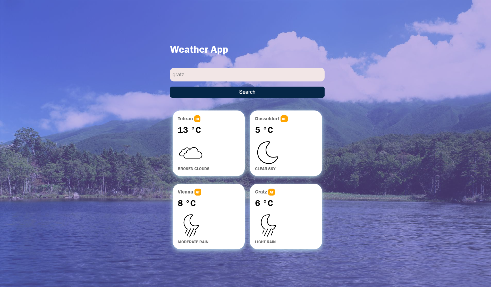

# Weather App using JavaScript

A weather app that pulls from the OpenWeatherMap API to allow users to search for and view the forecast in cities worldwide. Built with JavaScript.

Simple and optimized Weather App . It includes: 

- [x] JavaScripts
- [x] ECMAScript 6+
- [x] OpenWeatherMap API
- [x] Separate CSS stylesheets generation
- [x] Automatic HTML generation

## Starting the dev server

Make sure you have the latest version of ES6 installed.

1. `git clone https://github.com/am-abazari/WeatherApp`
2. Run `inde.html`
3. Open [http://127.0.0.1:5500/inde.html/](http://127.0.0.1:5500/inde.html)

## Code Coverage

The project is using the <strong>OpenWeatherMap</strong>. All configurations are located in `index.html`, inside the `body` object.

## About Author

<strong>Amirhossein Abazari</strong> Full-Stack Web Developer
